# Kingdom Stack Server

## Technical Decisions

### Azure blob storage

The API uses Azure Blob Storage for static game assets, user game saves, user preferences, and user-authored stack stamps.

- `game-assets` is used for shared assets such as tiles and characters.
- `user-games` is used for user save data.
- `user-preferences` is used for user preference data.
- `game-assets/stacks` is used for user-authored stack stamps.
- User save data is organized under `games/users/{scopeKey}/saves`.
- User preference data is organized under `preferences/users/{scopeKey}/preferences.json`.
- Stack stamps are organized under `stacks/users/{scopeKey}/stack-stamps/{stackStampId}`.

## API

### Root

- `GET /` returns a basic API status payload.

### Tile assets

- `GET /api/assets/tiles/list` lists tile assets, optionally filtered by `prefix`.
- `GET /api/assets/tiles/catalog` returns the tile catalog with image URLs.
- `GET /api/assets/tiles/tiles.json` returns the raw tile manifest JSON.
- `GET /api/assets/tiles/bundle` downloads the tile bundle zip.
- `GET /api/assets/tiles/{**blobPath}` returns a single tile asset by blob path.

### Character assets

- `GET /api/assets/characters/list` lists character assets, optionally filtered by `prefix`.
- `GET /api/assets/characters/bundle` downloads the characters bundle zip.
- `GET /api/assets/characters/{**blobPath}` returns a single character asset by blob path.

### Sound assets

- `GET /api/assets/sounds/list` lists sound assets, optionally filtered by `prefix`.
- `GET /api/assets/sounds/bundle` downloads the sounds bundle zip.
- `GET /api/assets/sounds/{**blobPath}` returns a single sound asset by blob path.

### Games

- `POST /api/games` upserts a user game JSON document.
- `GET /api/games` lists saved games for the current user, optionally filtered by `prefix`.
- `GET /api/games/{gameId}` returns a saved game by `gameId`.
- `DELETE /api/games/{gameId}` deletes a saved game by `gameId`.

`POST /api/games` request body:

```json
{
  "gameId": "my-first-game",
  "name": "My First Game",
  "game": {
    "gameId": "my-first-game",
    "name": "My First Game"
  }
}
```

### Preferences

- `POST /api/preferences` upserts the current user's preferences JSON document.
- `GET /api/preferences` returns the current user's preferences JSON document.
- `DELETE /api/preferences` deletes the current user's preferences JSON document.

`POST /api/preferences` request body:

```json
{
  "preferences": {
    "theme": "dark",
    "musicVolume": 0.8
  }
}
```

### Stack stamps

- `GET /api/assets/stack-stamps` lists the current user's stack stamps.
- `GET /api/assets/stack-stamps/{stackStampId}` returns one stack stamp definition plus metadata.
- `POST /api/assets/stack-stamps` creates a new stack stamp.
- `PUT /api/assets/stack-stamps/{stackStampId}` updates an existing stack stamp.
- `DELETE /api/assets/stack-stamps/{stackStampId}` deletes a stack stamp and its preview.
- `GET /api/assets/stack-stamps/{stackStampId}/preview` streams the preview PNG if present.

Supported stack stamp query parameters:

- `prefix`
- `search`
- `tag`
- `limit`
- `continuationToken`

`POST /api/assets/stack-stamps` request body:

```json
{
  "name": "Campfire Ring",
  "description": "Small outdoor camp setup",
  "tags": ["camp", "outdoor"],
  "definition": {
    "schemaVersion": 2,
    "origin": { "dx": 0, "dy": 0 },
    "entries": [
      {
        "entryId": "a1",
        "entityType": "tile",
        "entitySubtype": "static",
        "dx": 0,
        "dy": 0,
        "payload": {
          "tileId": "grass_patch_a",
          "view": "front"
        }
      }
    ],
    "stacks": [
      {
        "stackId": "stack-root",
        "name": "Root Stack",
        "anchorEntryId": "a1",
        "entryIds": ["a1"],
        "childStackIds": [],
        "parentStackId": null
      }
    ],
    "metadata": {
      "createdInKsEditorVersion": "1.0.0"
    }
  },
  "previewImageBase64": "iVBORw0KGgoAAAANSUhEUgAA..."
}
```

### Legacy

- `POST /api/assets/games` uploads a game-related file using multipart form data. This endpoint is marked obsolete in code and `POST /api/games` is preferred.

### Development

- `GET /api/assets/azure-identity` returns Azure credential and token claim details in development only.

## Security

### Azure roles

The `user-games` container requires the `Storage Blob Data Contributor` Azure role for the identity used by the API.

This role is needed because the API must be able to list, read, upload, update metadata, and delete blobs in `user-games`.

The `user-preferences` container should use the same `Storage Blob Data Contributor` role because the API reads, writes, and deletes the current user's preferences blob.

The `game-assets` container also needs blob data access for stack stamp reads and writes under the `stacks` prefix.

## StackStamp Architecture

The `StackStamp` feature is implemented as a dedicated vertical slice with its own controller, request/response DTOs, service-layer models, and blob-storage orchestration.

### Mermaid UML

```mermaid
classDiagram
    class StackStampsController {
        +ListStackStamps(prefix, search, tag, limit, continuationToken)
        +GetStackStamp(stackStampId)
        +CreateStackStamp(request)
        +UpdateStackStamp(stackStampId, request)
        +DeleteStackStamp(stackStampId)
        +GetStackStampPreview(stackStampId)
        -ValidateCreateOrUpdateRequest(name, definition)
        -ValidateStackGraphHasNoCycles(stacks)
        -TryDecodePreviewPng(previewImageBase64)
        -MapListItem(item)
        -MapDetail(item)
    }

    class AzureBlobProxyService {
        +ListUserStackStampsAsync(scopeKey, prefix, search, tag, limit, continuationToken)
        +UserStackStampNameExistsAsync(scopeKey, name, excludeStackStampId)
        +GetUserStackStampAsync(scopeKey, stackStampId)
        +SaveUserStackStampAsync(scopeKey, stackStampId, name, description, tags, definition, previewBytes, previewContentType, ifMatchEtag, clearPreview, createOnly)
        +GetUserStackStampPreviewAsync(scopeKey, stackStampId)
        +DeleteUserStackStampAsync(scopeKey, stackStampId)
        +NormalizeStackStampId(stackStampId)
        -BuildUserStackStampsRootPrefix(scopeKey)
        -BuildStackStampDefinitionRelativePath(stackStampId)
        -BuildStackStampPreviewRelativePath(stackStampId)
        -BuildStoredStackStampDocument(...)
        -BuildFootprint(definition)
    }

    class CreateStackStampRequest {
        +string? Name
        +string? Description
        +IReadOnlyList~string~? Tags
        +StackStampDefinitionDto? Definition
        +string? PreviewImageBase64
    }

    class UpdateStackStampRequest {
        +string? Name
        +string? Description
        +IReadOnlyList~string~? Tags
        +string? ETag
        +StackStampDefinitionDto? Definition
        +string? PreviewImageBase64
        +bool? ClearPreview
    }

    class StackStampDefinitionDto {
        +int SchemaVersion
        +StackStampOriginDto Origin
        +StackStampEntryDto[] Entries
        +StackStampGroupDto[]? Stacks
        +StackStampMetadataDto? Metadata
    }

    class StackStampOriginDto {
        +int Dx
        +int Dy
    }

    class StackStampEntryDto {
        +string EntryId
        +string EntityType
        +string? EntitySubtype
        +int Dx
        +int Dy
        +JsonElement Payload
    }

    class StackStampGroupDto {
        +string StackId
        +string Name
        +string AnchorEntryId
        +string[] EntryIds
        +string[] ChildStackIds
        +string? ParentStackId
    }

    class StackStampMetadataDto {
        +string? CreatedInKsEditorVersion
        +Dictionary~string,string~? Custom
    }

    class StackStampListResponse {
        +string Prefix
        +int Count
        +string? ContinuationToken
        +IReadOnlyList~StackStampListItemResponse~ Items
    }

    class StackStampListItemResponse {
        +string Id
        +string Name
        +string? Description
        +string BlobPath
        +string LoadUrl
        +string? PreviewUrl
        +int SchemaVersion
        +int Version
        +string[] Tags
        +StackStampFootprintResponse Footprint
        +int EntryCount
        +string[] TileReferences
        +string[] CharacterReferences
        +DateTimeOffset? CreatedAt
        +DateTimeOffset? LastModified
        +string? ETag
    }

    class StackStampResponse {
        +string Id
        +string Name
        +string? Description
        +string BlobPath
        +string LoadUrl
        +string? PreviewUrl
        +int SchemaVersion
        +int Version
        +string[] Tags
        +DateTimeOffset? CreatedAt
        +DateTimeOffset? LastModified
        +string? ETag
        +StackStampDefinitionDto Definition
    }

    class StackStampFootprintResponse {
        +int MinDx
        +int MinDy
        +int MaxDx
        +int MaxDy
        +int Width
        +int Height
    }

    class StoredStackStampDocument {
        +string Id
        +string Name
        +string? Description
        +int SchemaVersion
        +int Version
        +string[] Tags
        +int EntryCount
        +string[] TileReferences
        +string[] CharacterReferences
        +StackStampFootprintResponse Footprint
        +bool HasPreview
        +StackStampDefinitionDto Definition
    }

    class UserStackStampListResult {
        +IReadOnlyList~UserStackStampListItem~ Items
        +string? ContinuationToken
    }

    class UserStackStampListItem {
        +string Id
        +string Name
        +string? Description
        +string BlobPath
        +bool HasPreview
        +int SchemaVersion
        +int Version
        +string[] Tags
        +StackStampFootprintResponse Footprint
        +int EntryCount
        +string[] TileReferences
        +string[] CharacterReferences
        +DateTimeOffset? CreatedAt
        +DateTimeOffset? LastModified
        +string? ETag
    }

    class UserStackStampContent {
        +string Id
        +string Name
        +string? Description
        +string BlobPath
        +bool HasPreview
        +int SchemaVersion
        +int Version
        +string[] Tags
        +DateTimeOffset? CreatedAt
        +DateTimeOffset? LastModified
        +string? ETag
        +StackStampDefinitionDto Definition
    }

    class UserStackStampSaveResult {
        +string Id
        +string Name
        +string? Description
        +string BlobPath
        +bool HasPreview
        +int SchemaVersion
        +int Version
        +string[] Tags
        +DateTimeOffset? CreatedAt
        +DateTimeOffset? LastModified
        +string? ETag
        +StackStampDefinitionDto Definition
    }

    StackStampsController --> AzureBlobProxyService
    StackStampsController --> CreateStackStampRequest
    StackStampsController --> UpdateStackStampRequest
    StackStampsController --> StackStampListResponse
    StackStampsController --> StackStampResponse
    CreateStackStampRequest --> StackStampDefinitionDto
    UpdateStackStampRequest --> StackStampDefinitionDto
    StackStampDefinitionDto --> StackStampOriginDto
    StackStampDefinitionDto --> StackStampEntryDto
    StackStampDefinitionDto --> StackStampGroupDto
    StackStampDefinitionDto --> StackStampMetadataDto
    StackStampListResponse --> StackStampListItemResponse
    StackStampListItemResponse --> StackStampFootprintResponse
    StackStampResponse --> StackStampDefinitionDto
    AzureBlobProxyService --> StoredStackStampDocument
    AzureBlobProxyService --> UserStackStampListResult
    AzureBlobProxyService --> UserStackStampContent
    AzureBlobProxyService --> UserStackStampSaveResult
    UserStackStampListResult --> UserStackStampListItem
    UserStackStampListItem --> StackStampFootprintResponse
    UserStackStampContent --> StackStampDefinitionDto
    UserStackStampSaveResult --> StackStampDefinitionDto
    StoredStackStampDocument --> StackStampDefinitionDto
    StoredStackStampDocument --> StackStampFootprintResponse
```



### File breakdown

#### Controller

- [StackStampsController.cs](/c:/Users/pilgr/myApps/csharp/servers/kingdom-stack-server/KingdomStackServer.Api/Controllers/StackStampsController.cs)
Purpose:
Handles HTTP routing, request validation, response mapping, preview validation, and user-scoped orchestration for stack stamps.

#### Service

- [AzureBlobProxyService.cs](/c:/Users/pilgr/myApps/csharp/servers/kingdom-stack-server/KingdomStackServer.Api/AzureBlobProxyService.cs)
Purpose:
Handles Azure Blob Storage access, stack stamp persistence, blob naming, list/search filtering, preview streaming, delete behavior, versioning, ETag handling, and stored metadata generation.

#### Request DTOs

- [CreateStackStampRequest.cs](/c:/Users/pilgr/myApps/csharp/servers/kingdom-stack-server/KingdomStackServer.Api/CreateStackStampRequest.cs)
- [UpdateStackStampRequest.cs](/c:/Users/pilgr/myApps/csharp/servers/kingdom-stack-server/KingdomStackServer.Api/UpdateStackStampRequest.cs)

Purpose:
Represent incoming API payloads for create and update operations.

#### Definition DTOs

- [StackStampDefinitionDto.cs](/c:/Users/pilgr/myApps/csharp/servers/kingdom-stack-server/KingdomStackServer.Api/StackStampDefinitionDto.cs)
- [StackStampOriginDto.cs](/c:/Users/pilgr/myApps/csharp/servers/kingdom-stack-server/KingdomStackServer.Api/StackStampOriginDto.cs)
- [StackStampEntryDto.cs](/c:/Users/pilgr/myApps/csharp/servers/kingdom-stack-server/KingdomStackServer.Api/StackStampEntryDto.cs)
- [StackStampGroupDto.cs](/c:/Users/pilgr/myApps/csharp/servers/kingdom-stack-server/KingdomStackServer.Api/StackStampGroupDto.cs)
- [StackStampMetadataDto.cs](/c:/Users/pilgr/myApps/csharp/servers/kingdom-stack-server/KingdomStackServer.Api/StackStampMetadataDto.cs)

Purpose:
Represent the reusable stack stamp definition, including origin, entries, schema-v2 group hierarchy, and optional metadata.

#### Response DTOs

- [StackStampListResponse.cs](/c:/Users/pilgr/myApps/csharp/servers/kingdom-stack-server/KingdomStackServer.Api/StackStampListResponse.cs)
- [StackStampListItemResponse.cs](/c:/Users/pilgr/myApps/csharp/servers/kingdom-stack-server/KingdomStackServer.Api/StackStampListItemResponse.cs)
- [StackStampResponse.cs](/c:/Users/pilgr/myApps/csharp/servers/kingdom-stack-server/KingdomStackServer.Api/StackStampResponse.cs)
- [StackStampFootprintResponse.cs](/c:/Users/pilgr/myApps/csharp/servers/kingdom-stack-server/KingdomStackServer.Api/StackStampFootprintResponse.cs)

Purpose:
Define the API response shapes for list and detail endpoints.

#### Internal service models

- [StoredStackStampDocument.cs](/c:/Users/pilgr/myApps/csharp/servers/kingdom-stack-server/KingdomStackServer.Api/StoredStackStampDocument.cs)
- [UserStackStampListItem.cs](/c:/Users/pilgr/myApps/csharp/servers/kingdom-stack-server/KingdomStackServer.Api/UserStackStampListItem.cs)
- [UserStackStampListResult.cs](/c:/Users/pilgr/myApps/csharp/servers/kingdom-stack-server/KingdomStackServer.Api/UserStackStampListResult.cs)
- [UserStackStampContent.cs](/c:/Users/pilgr/myApps/csharp/servers/kingdom-stack-server/KingdomStackServer.Api/UserStackStampContent.cs)
- [UserStackStampSaveResult.cs](/c:/Users/pilgr/myApps/csharp/servers/kingdom-stack-server/KingdomStackServer.Api/UserStackStampSaveResult.cs)

Purpose:
Represent the blob-stored document shape and the internal service-layer models passed between storage code and controller mapping.

### Storage model

Each stack stamp is stored under the current user’s scope:

- `stacks/users/{scopeKey}/stack-stamps/{stackStampId}/definition.json`
- `stacks/users/{scopeKey}/stack-stamps/{stackStampId}/preview.png`

The stored `definition.json` is the authoritative document and includes:

- user-facing metadata
- schema/version
- computed footprint
- computed tile references
- computed character references
- preview presence
- full stack stamp definition

### Validation rules

The controller currently enforces:

- `name` required
- `definition` required
- `schemaVersion` must be `1` or `2`
- `entries` must be non-empty
- `entryId` must be unique
- duplicate occupied cells are rejected
- tile entries must include `payload.tileId`
- character entries must include `payload.characterId`
- preview must be valid PNG base64 when supplied

Schema version `2` additionally enforces:

- unique `stackId`
- each stack must have `name`
- each stack must have `anchorEntryId`
- `anchorEntryId` must exist in entries
- `entryIds` must be non-empty
- `anchorEntryId` must also appear in `entryIds`
- entries may belong to only one stack
- `childStackIds` and `parentStackId` must reference real stacks
- stack graph must be acyclic

### Update semantics

- `POST` creates a new stack stamp with a server-generated id.
- `PUT` updates an existing stack stamp and requires `etag`.
- names must be unique per user scope.
- `previewImageBase64` and `clearPreview = true` cannot be sent together.
- if preview is omitted on update, the existing preview remains unchanged.
- if `clearPreview = true`, preview is removed.
- preview mutation happens before `definition.json` is written.
- `definition.json` is the final authoritative write.
